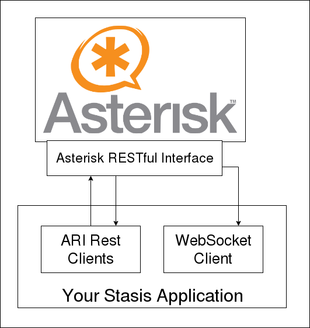

# Asterisk REST Interface (ARI) Client :telephone:
> Grab yourself some coffee and save plenty of time with this object oriented ARI client library. 
Keeping your code nice and clean. Taking care of easy REST calls to Asterisk. Handling incoming messages for you
while you focus on developing your Stasis apps.

## Installation
Install the composer and include this library into your project

`composer require ng-voice/asterisk-ari-client`

While installing, you might run into composer errors concerning missing php extensions.
There are several ways to install them, depending on your operating system (e.g. `apt install php7.3-http`).

Don't forget to restart your server after installing the extensions.

##### Asterisk
You will have to start an Asterisk instance and configure it in order to use ARI.
The official Asterisk documentation shows you how to do so. 

https://wiki.asterisk.org/wiki/display/AST/Asterisk+Configuration+for+ARI

Alternatively use the provided Dockerfile in the docker directory as described below.

##### ARI abstraction layer
The idea of this client library is to make ARI calls safe and easy. Therefore, I wanted to get rid of 
JSON parsing in my application code. Instead, I aim to make it as easy as possible for anyone to talk to ARI without 
worrying about an implementation of a client stub. I already did the work for you :)

## Features
#### REST Clients
Talk to your asterisk instance by the given well documented HTTP clients.
All requests and responses are mapped onto objects that are easy to understand.

#### Web socket client
Connects to Asterisk via `GET /events` and subscribes either to one, many or all stasis applications running on your 
Asterisk instance.

#### Asynchronous stasis application principle

You can check ExampleApp in `examples` directory for some basic event's logic.

#### Asterisk Docker container
Preferably use the provided Dockerfile in this library to compile your own asterisk container.
    
    cd docker/asterisk
    docker build -t --build-arg asterisk_version=16.2.1 asterisk:latest .
    docker run -d --name some-asterisk -p 8088:8088 -p 5060:5060 -p 5060:5060/udp asterisk:latest

    !!! PLEASE NOTE !!!
    Compiling Asterisk sometimes is bound to the hardware you are compiling it on.
    Right now we compile an own container for every machine we run Asterisk on,
    to make sure it will work.
    Alternatively you can set generic compiler flags at your own risk.

## How to use

You can find example in the `examples` directory.

Here is the class, which is handling local event called `channelHangupRequest`

      /*
       * A default message event handler for channels that have been hung up.
       *
       * @param ChannelHangupRequest $channelHangupRequest The Asterisk Request
       */
     public function channelHangupRequest(ChannelHangupRequest $channelHangupRequest): void
     {
         $this->logger->info(
             'This is the default hangup handler triggered by channel '
             . "'{$channelHangupRequest->getChannel()->getId()}' :-)"
         );
     }

Now, how should we handle events, that are sent to our WebSocketClient workers?

Out of the box you can use the `LocalAppMessageHandler` (handling event objects in a local App) 
or the `RemoteAppMessageHandler` (sending events to another API) but of course you can write your own.

## Tests

To run the test for mocked ARI Messages and Websocket. Please run the following:

`composer test`

##Licence

#####MIT © ng-voice GmbH (2019)

##Contact
ng-voice is happy to help! Feel free to send me a message.
I'd also like to hear about your application ideas and use cases :)

Lukas Stermann (lukas@ng-voice.com)
Ahmad Hussain  (ahmad@ng-voice.com)